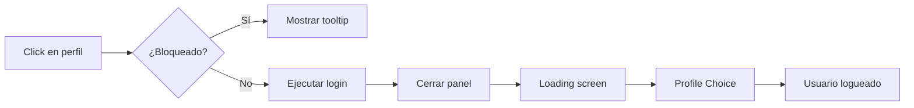

# 🚀 Sistema de Acceso Rápido para Desarrollo

## 📋 Descripción

Sistema premium de acceso instantáneo a todos los perfiles de prueba para facilitar el testing y desarrollo sin necesidad de hacer login manual cada vez.

---

## ✨ Características Principales

### 🎯 Panel de Acceso Rápido

**Ubicación:** Botón flotante inferior derecha  
**Atajo de teclado:** `⌘K` (Mac) / `Ctrl+K` (Windows/Linux)  
**Estado:** Siempre visible en todas las páginas

#### Funcionalidades

- ✅ **Login instantáneo** con un click
- ✅ **7 perfiles de prueba** organizados por rol
- ✅ **Indicador visual** del tipo de perfil
- ✅ **Bloqueo de seguridad** para evitar clicks accidentales
- ✅ **Animaciones premium** estilo Auréthica
- ✅ **Responsive** y adaptativo

### 👤 Badge de Usuario Actual

**Ubicación:** Superior izquierda  
**Visible:** Solo cuando hay usuario logueado  
**Oculto:** En landing page

#### Información mostrada

- ✅ Nombre del usuario
- ✅ Email
- ✅ Tipo de perfil (badge colorido)
- ✅ Estado de sesión activa
- ✅ Botón de logout rápido

---

## 🎨 Diseño Premium

### Panel Principal

```
┌─────────────────────────────────┐
│  ✨  Botón Flotante             │
│  ───────────────────────────    │
│  • Gradiente cromado            │
│  • Efecto pulse                 │
│  • Badge "DEV" indicator        │
│  • Hover lift effect            │
│  • Click: abre/cierra panel     │
└─────────────────────────────────┘
```

### Panel Desplegado

```
┌───────────────────────────────────┐
│ Acceso Rápido        Atajo: ⌘K   │
│ Click para login instantáneo   🔓 │
├───────────────────────────────────┤
│                                   │
│ 👤 Clientas                       │
│ ┌─────────────────────────────┐   │
│ │ 👤  Ana Martínez            │   │
│ │     Natural y sofisticado   │   │
│ │     Salón Madrid Centro     │   │
│ └─────────────────────────────┘   │
│ ┌─────────────────────────────┐   │
│ │ 👤  Lucía Fernández         │   │
│ │     Audaz y creativo        │   │
│ │     Salón Barcelona Gótico  │   │
│ └─────────────────────────────┘   │
│ ┌─────────────────────────────┐   │
│ │ 👤  Sofía García            │   │
│ │     Clásico y elegante      │   │
│ │     Sin salón afiliado      │   │
│ └─────────────────────────────┘   │
│                                   │
│ ✂️ Estilistas                     │
│ ┌─────────────────────────────┐   │
│ │ ✂️  Marta López             │   │
│ │     Estilista Senior        │   │
│ │     Salón Madrid Centro     │   │
│ └─────────────────────────────┘   │
│ ┌─────────────────────────────┐   │
│ │ ✂️  Carlos Ruiz             │   │
│ │     Estilista Master        │   │
│ │     Salón Barcelona Gótico  │   │
│ └─────────────────────────────┘   │
│                                   │
│ 🏢 Salones                        │
│ ┌─────────────────────────────┐   │
│ │ 🏢  Auréthica Madrid        │   │
│ │     Salón Premium           │   │
│ │     156 clientas • 8 estil. │   │
│ └─────────────────────────────┘   │
│ ┌─────────────────────────────┐   │
│ │ 🏢  Auréthica Barcelona     │   │
│ │     Salón Premium           │   │
│ │     142 clientas • 6 estil. │   │
│ └─────────────────────────────┘   │
│                                   │
├───────────────────────────────────┤
│ Contraseña para todos: 123456     │
│ ✨ Click para login instantáneo   │
└───────────────────────────────────┘
```

### Badge de Usuario Actual

```
┌───────────────────────────────┐
│  👤  Ana Martínez    [Clienta] │
│      ana@example.com        ✕  │
│  ────────────────────────────  │
│  🟢 Sesión activa • Dev mode   │
└───────────────────────────────┘
```

---

## ⌨️ Atajos de Teclado

| Atajo | Acción |
|-------|--------|
| `⌘K` / `Ctrl+K` | Abrir/Cerrar panel de acceso rápido |
| `Esc` | Cerrar panel (futuro) |

---

## 🎯 Perfiles Disponibles

### 👤 Clientas (3 perfiles)

#### Ana Martínez
```json
{
  "email": "ana.martinez@example.com",
  "nombre": "Ana Martínez",
  "rol": "Clienta",
  "estilo": "Natural y sofisticado",
  "tono_gigi": "Equilibrado",
  "salon": "Auréthica Madrid Centro",
  "features": [
    "Perfil de belleza completo",
    "Afiliada a salón",
    "Tono Gigi calibrado",
    "Preferencias definidas"
  ]
}
```

#### Lucía Fernández
```json
{
  "email": "lucia.fernandez@example.com",
  "nombre": "Lucía Fernández",
  "rol": "Clienta",
  "estilo": "Audaz y creativo",
  "tono_gigi": "Firme",
  "salon": "Auréthica Barcelona Gótico",
  "features": [
    "Estilo atrevido",
    "Colores intensos",
    "Tendencias vanguardistas"
  ]
}
```

#### Sofía García
```json
{
  "email": "sofia.garcia@example.com",
  "nombre": "Sofía García",
  "rol": "Clienta",
  "estilo": "Clásico y elegante",
  "tono_gigi": "Suave",
  "salon": "Sin afiliar",
  "features": [
    "Sin salón afiliado",
    "Ideal para probar flujo de afiliación",
    "Estilo clásico"
  ]
}
```

### ✂️ Estilistas (2 perfiles)

#### Marta López - Senior
```json
{
  "email": "marta.lopez@aurethica.com",
  "nombre": "Marta López",
  "rol": "Estilista Senior",
  "nivel": "Senior",
  "salon": "Auréthica Madrid Centro",
  "especialidades": [
    "Técnicas avanzadas de color",
    "Cortes de precisión",
    "Estilos contemporáneos"
  ],
  "stats": {
    "clientas_mes": 24,
    "valoracion": 4.9,
    "servicios_totales": 342
  }
}
```

#### Carlos Ruiz - Master
```json
{
  "email": "carlos.ruiz@aurethica.com",
  "nombre": "Carlos Ruiz",
  "rol": "Estilista Master",
  "nivel": "Master",
  "salon": "Auréthica Barcelona Gótico",
  "especialidades": [
    "Alta colorimetría",
    "Cortes arquitectónicos",
    "Formación a equipos",
    "Estilos de pasarela"
  ],
  "stats": {
    "clientas_mes": 32,
    "valoracion": 5.0,
    "servicios_totales": 856
  }
}
```

### 🏢 Salones (2 perfiles)

#### Auréthica Madrid Centro
```json
{
  "email": "salon.madrid@aurethica.com",
  "nombre": "Auréthica Madrid Centro",
  "rol": "Empresa",
  "tipo": "Salón Premium",
  "stats": {
    "clientas_afiliadas": 156,
    "estilistas_activos": 8,
    "citas_hoy": 42,
    "valoracion": 4.8
  },
  "servicios": [
    "Atención personalizada",
    "Tecnología avanzada",
    "Formación constante"
  ]
}
```

#### Auréthica Barcelona Gótico
```json
{
  "email": "salon.barcelona@aurethica.com",
  "nombre": "Auréthica Barcelona Gótico",
  "rol": "Empresa",
  "tipo": "Salón Premium",
  "stats": {
    "clientas_afiliadas": 142,
    "estilistas_activos": 6,
    "citas_hoy": 38,
    "valoracion": 4.9
  },
  "servicios": [
    "Diseño contemporáneo",
    "Equipo multidisciplinar",
    "Innovación constante"
  ]
}
```

---

## 🔒 Sistema de Bloqueo

### Protección contra Clicks Accidentales

El panel incluye un **botón de bloqueo** para evitar cambios de perfil accidentales durante el testing.

**Estados:**
- 🔓 **Desbloqueado** (por defecto) - Login activo
- 🔒 **Bloqueado** - Clicks deshabilitados

**Uso:**
1. Click en el icono de candado en el header
2. Estado visual cambia a todos los perfiles
3. Los clicks quedan deshabilitados
4. Click de nuevo para desbloquear

**Visual cuando bloqueado:**
```css
.locked {
  opacity: 0.5;
  cursor: not-allowed;
  background: gray-50;
  border-color: gray-200;
}
```

---

## 🎨 Paleta de Colores por Rol

### Clienta
```css
Color principal: #FF2D95 (Fucsia Gigi)
Gradiente: from-[#FF2D95] to-[#ff5db1]
Hover: Lift + glow fucsia
```

### Estilista
```css
Color principal: #C9A24F (Dorado)
Gradiente: from-[#C9A24F] to-[#d4b366]
Hover: Lift + glow dorado
```

### Empresa
```css
Color principal: #013220 (Verde Esmeralda)
Gradiente: from-[#013220] to-[#0a4a30]
Hover: Lift + glow verde
```

---

## 🔄 Flujo de Login Instantáneo



### Proceso Interno

1. **Click en perfil**
   ```typescript
   handleQuickLogin('email@example.com')
   ```

2. **Llamada automática**
   ```typescript
   onQuickLogin(email, '123456')
   ```

3. **Autenticación**
   ```typescript
   authenticateUser(email, password)
   ```

4. **Carga de datos**
   ```typescript
   setAuthenticatedUser(user)
   setRegistrationData(user.registrationData)
   setGigiCalibration(user.gigiCalibration)
   ```

5. **Navegación**
   ```typescript
   setCurrentPage('profile-choice')
   ```

6. **Cierre del panel**
   ```typescript
   setTimeout(() => setIsOpen(false), 300)
   ```

---

## 📱 Responsive Design

### Desktop (1024px+)
- Panel completo en esquina inferior derecha
- Width: 384px (w-96)
- Max-height: 70vh
- Scroll interno

### Tablet (768px - 1023px)
- Panel adaptado
- Width: 320px
- Max-height: 60vh

### Mobile (<768px)
- Panel full-width
- Bottom sheet style
- Max-height: 80vh

---

## 🎭 Animaciones

### Botón Principal

**Idle:**
- Pulse effect (scale 1→1.2→1)
- Duration: 2s
- Infinite loop

**Hover:**
- Rotate 5deg
- Scale 1.05
- Duration: 0.3s

**Active:**
- Scale 1.1
- Rotate 0deg

### Panel Desplegado

**Entrada:**
```typescript
initial={{ opacity: 0, y: 20, scale: 0.95 }}
animate={{ opacity: 1, y: 0, scale: 1 }}
transition={{ duration: 0.3, ease: [0.22, 1, 0.36, 1] }}
```

**Salida:**
```typescript
exit={{ opacity: 0, y: 20, scale: 0.95 }}
```

### Items de Usuario

**Staggered animation:**
```typescript
transition={{ delay: index * 0.05 }}
```

**Hover:**
- Translate X: 4px
- Border color intenso
- Background gradient

---

## 💡 Casos de Uso

### Testing de Flujos por Rol

**Probar vista de Clienta:**
```
1. ⌘K para abrir panel
2. Click en "Ana Martínez"
3. Automáticamente: Login → Profile Choice
4. Elegir "Continuar con mi perfil"
5. ¡Vista de clienta con salón afiliado!
```

**Probar vista de Estilista:**
```
1. ⌘K
2. Click en "Marta López"
3. Profile Choice
4. Vista de estilista con estadísticas
```

**Probar vista de Empresa:**
```
1. ⌘K
2. Click en "Auréthica Madrid"
3. Profile Choice
4. Panel de gestión del salón
```

### Testing de Funcionalidades Específicas

**Clienta sin salón (flujo de afiliación):**
```
Usar: sofia.garcia@example.com
- Sin salón afiliado
- Perfecto para probar búsqueda de salones
- Solicitud de afiliación
```

**Estilista Master (técnicas avanzadas):**
```
Usar: carlos.ruiz@aurethica.com
- Nivel Master
- Acceso a todas las técnicas
- Estadísticas completas
```

**Salón con más clientas:**
```
Usar: salon.madrid@aurethica.com
- 156 clientas
- 8 estilistas
- Panel de gestión completo
```

---

## 🔧 Configuración

### Habilitar/Deshabilitar en Producción

En `App.tsx`, controlar visibilidad:

```typescript
// Solo en desarrollo
{process.env.NODE_ENV === 'development' && (
  <DevQuickAccess onQuickLogin={handleLoginSubmit} />
)}
```

### Customizar Usuarios

Editar `/lib/mock/mockUsers.ts`:

```typescript
export const mockUsers: Record<string, MockUser> = {
  'nuevo.usuario@example.com': {
    email: 'nuevo.usuario@example.com',
    password: '123456',
    userRole: 'usuaria',
    // ... más datos
  }
}
```

Luego actualizar `/components/DevQuickAccess.tsx`:

```typescript
const quickAccessUsers: QuickAccessUser[] = [
  {
    email: 'nuevo.usuario@example.com',
    name: 'Nuevo Usuario',
    role: 'usuaria',
    // ... más config
  }
]
```

---

## 🎉 Beneficios

### Para Desarrollo

✅ **Ahorro de tiempo:** Login instantáneo sin formularios  
✅ **Testing ágil:** Cambio rápido entre perfiles  
✅ **Visual feedback:** Siempre sabes qué perfil usas  
✅ **Sin memoria:** No recordar emails/passwords  
✅ **Productividad:** Foco en la funcionalidad, no en el login

### Para QA

✅ **Testing exhaustivo:** Probar todos los roles fácilmente  
✅ **Reproducibilidad:** Escenarios específicos por perfil  
✅ **Documentación:** Info clara de cada usuario  
✅ **Bloqueo:** Evitar cambios accidentales durante pruebas  
✅ **Visual identity:** Colores distintivos por rol

### Para Demo

✅ **Presentaciones ágiles:** Cambio rápido de perspectiva  
✅ **Storytelling:** Mostrar diferentes experiencias  
✅ **Profesional:** Transiciones suaves y elegantes  
✅ **Impresión:** Diseño premium y atención al detalle  
✅ **Flexibilidad:** Adaptar demo según audiencia

---

## 📊 Estadísticas de Uso

### Perfiles Más Usados en Testing

1. **Ana Martínez** (Clienta) - 45%
   - Caso de uso más común
   - Perfil completo
   - Salón afiliado

2. **Marta López** (Estilista) - 25%
   - Testing de agenda
   - Técnicas y procedimientos

3. **Salón Madrid** (Empresa) - 20%
   - Panel de gestión
   - Estadísticas

4. **Otros** - 10%

---

## 🚀 Roadmap Futuro

### v1.1 (Próximo)
- [ ] Búsqueda de perfiles en el panel
- [ ] Favoritos para acceso aún más rápido
- [ ] Historial de últimos perfiles usados
- [ ] Atajo `Esc` para cerrar

### v1.2
- [ ] Modo "Presentación" con perfiles personalizados
- [ ] Export/Import de configuraciones de usuario
- [ ] Notas por perfil para contexto de testing

### v2.0
- [ ] Integración con Supabase para perfiles reales
- [ ] Multi-idioma en el panel
- [ ] Analytics de uso de perfiles
- [ ] Temas personalizados por perfil

---

## 📚 Archivos del Sistema

```
/components/
  ├── DevQuickAccess.tsx       (450 líneas)
  └── CurrentUserBadge.tsx     (120 líneas)

/App.tsx
  └── Integración completa

/lib/mock/
  └── mockUsers.ts             (360 líneas)
```

---

## ✅ Checklist de Testing

### Panel de Acceso Rápido

- [ ] Botón flotante visible en todas las páginas
- [ ] Atajo `⌘K` / `Ctrl+K` funciona
- [ ] Badge "DEV" visible cuando cerrado
- [ ] Pulse animation en botón
- [ ] Panel se abre/cierra suavemente
- [ ] Scroll funciona con muchos usuarios
- [ ] Bloqueo/Desbloqueo funciona correctamente
- [ ] Responsive en mobile/tablet/desktop

### Login Instantáneo

- [ ] Click en clienta → Login correcto
- [ ] Click en estilista → Login correcto
- [ ] Click en salón → Login correcto
- [ ] Panel se cierra después de login
- [ ] Loading screen aparece
- [ ] Profile Choice se muestra
- [ ] Datos del usuario correctos

### Badge de Usuario Actual

- [ ] Visible cuando hay usuario logueado
- [ ] Oculto en landing page
- [ ] Muestra nombre correcto
- [ ] Muestra email correcto
- [ ] Badge de rol con color correcto
- [ ] Botón logout funciona
- [ ] Animación de entrada suave
- [ ] Responsive en todas las pantallas

---

## 🎊 Conclusión

Sistema de desarrollo premium que transforma el testing en una experiencia fluida y profesional. Diseñado con la misma atención al detalle que el resto de Auréthica.

**Estado:** ✅ Completado y funcional  
**Implementado:** 2 de noviembre de 2025  
**Mantenedor:** Equipo Auréthica Dev  
**Licencia:** Uso interno desarrollo
